# GAUDI: A Neural Architect for Immersive 3D Scene Generation, [Arxiv](https://arxiv.org/abs/2207.13751). 

<p align="center">
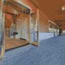
&nbsp;
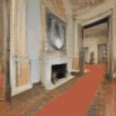
&nbsp;
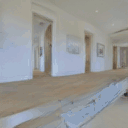
&nbsp;
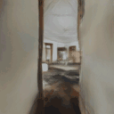
&nbsp;
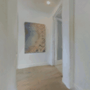
&nbsp;
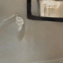
</p>

<p align="center">
Samples from GAUDI (Allow a couple minutes of loading time for videos.)
</p>


<p align="center">
<a href="https://scholar.google.com/citations?hl=en&user=ZrRs-qoAAAAJ"> Miguel Angel Bautista*</a>,
<a href="https://scholar.google.com/citations?user=O0yBqysAAAAJ&hl=en&oi=ao"> Pengsheng Guo*</a>,
<a href="https://scholar.google.com/citations?hl=en&user=jbxwjgMAAAAJ"> Samira Abnar</a>,
<a href="https://scholar.google.com/citations?hl=en&user=Wf4sG10AAAAJ"> Walter Talbott</a>,
<a href="https://scholar.google.com/citations?hl=en&user=T6PbwPIAAAAJ"> Alexander Toshev</a>,
<a href="https://scholar.google.com/citations?hl=en&user=CWCGa-IAAAAJ"> Zhuoyuan Chen</a>,
<a href="https://scholar.google.com/citations?hl=en&user=h7OHSkoAAAAJ"> Laurent Dinh</a>,
<a href="https://scholar.google.com/citations?hl=en&user=G6vdBYsAAAAJ"> Shuangfei Zhai</a>,
<a href="https://scholar.google.com/citations?hl=en&user=B_5DFeMAAAAJ"> Hanlin Goh</a>,
<a href="https://scholar.google.com/citations?hl=en&user=zIXl1-QAAAAJ"> Daniel Ulbricht</a>,
<a href="https://scholar.google.com/citations?hl=en&user=wcX-UW4AAAAJ"> Afshin Dehghan</a>,
<a href="https://scholar.google.com/citations?hl=en&user=Sv2TGqsAAAAJ&view_op=list_works&sortby=pubdate">Joshua M. Susskind</a>
<br> Apple (*equal contribution)
</p>

## Summary

* We introduce GAUDI, a generative model that captures the distribution of 3D scenes parametrized as radiance fields.
* We decompose generative model in two steps: (i) Optimizing a latent representation of 3D radiance fields and corresponding camera poses. (ii) Learning a powerful score based generative model on latent space.
* GAUDI obtains state-of-the-art performance accross multiple datasets for unconditional generation and enables conditional generation of 3D scenes from different modalities like text or RGB images.

<details>
  <summary>Expand Abstract</summary>
  
*We introduce __GAUDI__, a generative model capable of capturing the distribution of complex and realistic 3D scenes that can be rendered immersively from a moving camera. We tackle this challenging problem with a scalable yet powerful approach, where we first optimize a latent representation that disentangles radiance fields and camera poses. This latent representation is then used to learn a generative model that enables both unconditional and conditional generation of 3D scenes. Our model generalizes previous works that focus on single objects by removing the assumption that the camera pose distribution can be shared across samples. We show that GAUDI obtains state-of-the-art performance in the unconditional generative setting across multiple datasets and allows for conditional generation of 3D scenes given conditioning variables like sparse image observations or text that describes the scene.*
</details>

## Model

Our model is composed of two stages: latent representation optimization and generative modeling. Finding powerful latent representation for scene radiance fields and camera poses is critical to obtain good performance. To achieve this, we design a decoder with three modules:

* A scene decoder $d$ that takes as input scene latents and outputs a tri-plane latent representation to condition a the radiance field MLP.
* A camera pose decoder $c$ that takes as input a camera pose latent and a timestamp and outputs a camera pose.
* A radiance field $f$ that takes as input a 3d point and is conditioned on the tri-plane representation.

The parameters of all the modules and the latents for scene and camera poses are optimized in the first stage. In the second stage, we learn a score-based generative model in latent space.

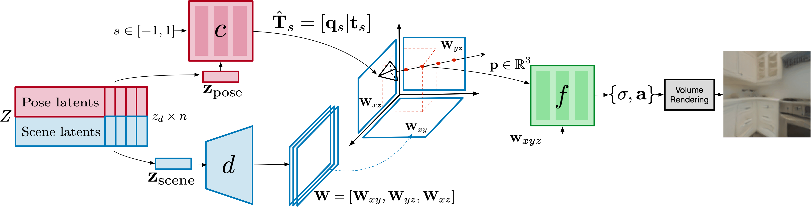

## Results
We present qualitative results for both unconditional and conditional generative modeling. During inference, we sample latents from the generative model and feed them through the decoder to obtain a radiance field and camera path. In the conditional setting we train the generative model using pairs of latents and conditioning variables (like text or images) and sample latents given conditioning variables during inference.

### Uncoditional generation
Random samples from the unconditional version of GAUDI for 4 different datasets: [Vizdoom](<https://apple.github.io/ml-gsn/>), [Replica](<https://apple.github.io/ml-gsn/>), [VLN-CE](https://github.com/jacobkrantz/VLN-CE) and [ARKITScenes](<https://github.com/apple/ARKitScenes>).


<p align="center">


<br>


</p>


### Text conditional generation
Random samples from a text conditional GAUDI model trained on VLN-CE.

<p align="center">
Prompt: "go down the stairs"
</p>
<p align="center">
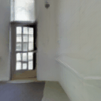
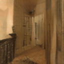

</p>

<p align="center">
Prompt: "go through the hallway"
</p>
<p align="center">
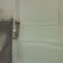
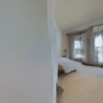
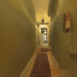
</p>

<p align="center">
Prompt: "go up the stairs"
</p>
<p align="center">
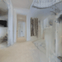
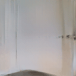
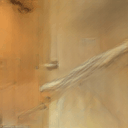
</p>

<p align="center">
Prompt: "walk into the kitchen"
</p>
<p align="center">
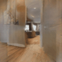
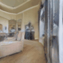
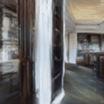
</p>


### Image conditional generation
Random samples from a image conditional GAUDI model trained on VLN-CE.

<p align="center">
Image prompt
</p>
<p align="center">
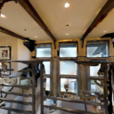
</p>
<p align="center">
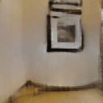
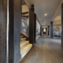
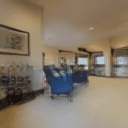
</p>
<p align="center">
Image prompt
</p>
<p align="center">
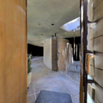
</p>
<p align="center">
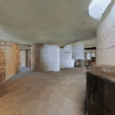
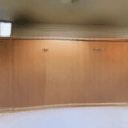
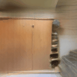
</p>
<p align="center">
Image prompt
</p>
<p align="center">
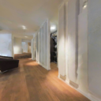
</p>
<p align="center">
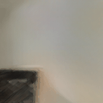
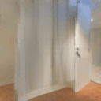
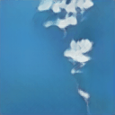
</p>
<p align="center">
Image prompt
</p>
<p align="center">
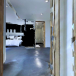
</p>
<p align="center">
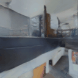
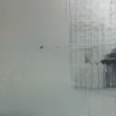
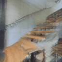
</p>


### Interpolation

We can linearly interpolate the latent representation of two scenes (leftmost and rightmost columns) and move the camera to explore the interpolated scene.

<p align="center">

</p>

## Citation


```
@article{bautista2022gaudi,
    title={GAUDI: A Neural Architect for Immersive 3D Scene Generation},
    author={Miguel Angel Bautista and Pengsheng Guo and Samira Abnar and Walter Talbott and Alexander Toshev and Zhuoyuan Chen and Laurent Dinh and Shuangfei Zhai and Hanlin Goh and Daniel Ulbricht and Afshin Dehghan and Josh Susskind},
    journal={arXiv},
    year={2022}
}
```

The author's copyright under the videos provided here are licensed under the CC-BY-NC license.

## Source code

Source code will be available in the following weeks.

## Related links

Check out recent related work on making radiance fields generalize to multiple objects/scenes:

* [PixelNeRF](https://github.com/sxyu/pixel-nerf)
* [GRAF](https://github.com/autonomousvision/graf)
* [pi-GAN](https://marcoamonteiro.github.io/pi-GAN-website/)
* [IBRNet](https://ibrnet.github.io)
* [GSN](<https://apple.github.io/ml-gsn/>)
* [NeRF-VAE](<https://arxiv.org/abs/2104.00587>)
* [StyleNeRF](<https://jiataogu.me/style_nerf/>)
* [MP3D-license](http://kaldir.vc.in.tum.de/matterport/MP_TOS.pdf)
